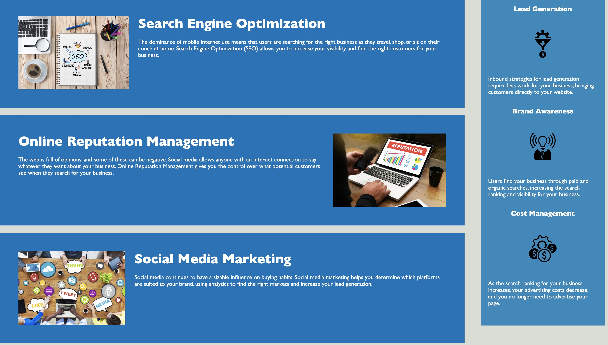

# Week 1 Challenge: improving client code

## Description

This webpage is a practice assignment for real world application. The goal is to help a client by modifying the existing code to allow for a cleaner and more accessible code. 

## Learning Objectives
This challenge includes many learning objectives for future web developers as they prepare to enter to workforce:

* Awareness of people with disabilities. It is essential in this day and age to have accessibility for everyone who enters a website. 

* Consolidated and organized CSS code to increase efficiency. The CSS code should follow the HTML flow and have comments before each section of the page. 

* Ensuring all links on the webpage are working correctly. As web developers, we want to leave the code better than we found it. 

* Implementing proper HTML semantics. Using descrpitive elements is best for organizing a webpage because they clearly define the content, making it easier to read the code and to make changes. 

## Mock Up

## Application link

https://thaling11.github.io/week-1-portfolio/

